# ADR-0001: Introduce a Declarative Storage API with Validation

## Status
Accepted

**Decision Owner:** AJ Schroeder
**Date:** 03-22-2026

---

## Context

Previously, storage configuration was embedded inside OS-specific installer templates and lacked consistent validation. This led to:

- Inconsistent disk layouts across distributions
- Fragile templates with hidden behavior
- Complex branching logic for different storage models
- Difficulty scaling templates to multiple use cases (LVM, non-LVM, multi-disk, growth scenarios)

Additionally, Packer imposes constraints:

- No optional attributes in variable schemas
- Strict structural typing
- Limited conditional object support

These constraints make it difficult to support multiple storage patterns safely without a validation layer.

---

## Decision

Adopt a **declarative Storage API** that:

- Defines storage intent via a single `vm_storage` structure
- Validates configurations at plan time
- Normalizes input into a deterministic `storage_plan`
- Renders consistent layouts across all supported distributions

### Key Characteristics

- Supports both LVM-based and partition-only layouts
- Supports single-disk and multi-disk configurations
- Supports multiple volume groups, mixed filesystem types, and grow-to-fill semantics
- Enforces strict validation rules (fail fast)
- Keeps all storage logic out of installer templates

### Architectural Model

  

### Packer Constraints

Due to Packer limitations:

- `volume_groups` must always be defined (use `[]` if unused)
- Attributes like `vg` must use `null` when not applicable
- Conditional object schemas are not supported

These constraints are handled at the API layer and documented for users.

---

## Consequences

### Positive

- Enables flexible, real-world storage scenarios while ensuring consistency
- Eliminates installer-specific storage logic
- Provides cross-distribution deterministic output
- Validates configurations before build time
- Scales cleanly as new layouts are introduced

### Negative

- Slightly increased upfront complexity in schema design
- Users must adhere to `null` vs `""` conventions
- Packer’s type limitations influence user-facing configuration

---

## Rationale

Instead of restricting users to a single storage model, the API enforces **valid configurations over limited configurations**.
By separating intent, validation, and execution, the repository achieves both flexibility and correctness.

---

## Future Considerations

- Explore stronger schema enforcement for role-specific partitions
- Expand the library of validated storage recipes
- Improve error clarity for users when validation fails
- Consider long-term migration to richer type systems
