# Storage Recipes & Validation Matrix
## Overview

This repository implements a normalized Storage API for building Linux VM templates with Packer and Proxmox.
Rather than defining disk layouts inside OS-specific installers (Kickstart, Preseed, Autoinstall), storage is:

- defined once via vm_storage (inside `$CONFIG_DIR/linux-storage.pkr.hcl`)
- validated and normalized in HCL
- rendered consistently across all supported distributions

This document introduces **Storage Recipes** - predefined storage configurations - and the test matrix used to validate the Storage API.

## 🚀 Quick Start

If you're unsure where to begin:

👉 Use: `01-baseline-lvm.md`

- Works across all distributions
- Matches the default configuration
- Safe starting point

---

## 📚 Recipe Index

### General Purpose

| Use Case                      | Recipe             | Description                         |
| :---                          | :---               | :---                                |
| Default / safe starting point | 01-baseline-lvm.md | Single disk, LVM, highly compatible |
| Minimal system                | 02-no-lvm.md       | No LVM, simple partition layout     |

### Data Separation

| Use Case                | Recipe               | Description               |
| :---                    | :---                 | :---                      |
| OS + data disk          | 03-dual-disk-data.md | Separate disk for /data   |
| Multi-disk storage pool | 04-multi-disk-vg.md  | Combine disks into one VG |

### Dynamic / Flexible Storage
| Use Case              | Recipe              | Description                   |
| :---                  | :---                | :---                          |
| Auto-expand root      | 05-grow-lvm.md      | Uses all available disk space |
| Future disk expansion | 04-multi-disk-vg.md | Add disks to VG later         |

### Advanced / Edge Cases

| Use Case           | Recipe   | Description                 |
| :---               | :---     | :---                        |
| No LVM, multi-disk | (future) | Partition-only across disks |
| Mixed filesystems  | (future) | XFS + EXT4 layouts          |
| Multiple VGs       | (future) | Advanced LVM separation     |


## How to Choose

If you’re overthinking it, use this:

- Just need a VM that works?
  Baseline LVM

- Hate LVM or want simplicity?
  No LVM

- Running apps with data (databases, media, etc.)?
  Dual disk

- Want flexibility and scaling?
  Multi-disk VG

- Deploying templates that resize later?
  Grow LVM

## 🔧 Using a Storage Recipe

1. Open the recipe file
1. Copy the `vm_storage` block
1. Paste into your `$CONFIG_DIR/linux-storage.pkr.hcl`
1. Modify as needed:
   - disk sizes
   - mount points
   - filesystem types
1. Run your Packer build

## ⚠️ Distribution Compatibility Note

The storage recipes provided in this library are tested against a "Strict Baseline" (Debian).

- **The Debian Constraint:** Debian’s `partman` is the most sensitive installer supported by this API. It requires precise definitions for EFI partitions, LVM PV sizes, and device paths.
- **The "Universal" Guarantee:** Because we treat Debian as our primary validation target, any recipe listed here as "Supported" for Debian will function seamlessly on **Ubuntu (Subiquity)** and **Alma/Rocky Linux (Kickstart)**.

> [!TIP]
> If you are developing a custom storage layout, test it against a Debian build first. If `partman` accepts the recipe without hanging or throwing a "Partitioning Failed" error, it is safe to use across the entire Linux template catalog.

## Why This Exists

Before the Storage API, storage configuration was:

- duplicated across multiple installers (Debian, Rocky, Alma, etc.)
- driven by conditional logic inside templates
- dependent on keywords like autopart to alter behavior
- difficult to reason about and easy to break

This led to:

- inconsistent disk layouts between distributions
- fragile templates with hidden behavior
- painful updates and debugging
- no reliable way to validate configurations before build time

## The Core Problem

Templates were making decisions.

That approach does not scale.

---

## Design Approach

<p align="center">
  
</p>

The Storage API separates user intent, validation, and rendering to ensure consistent, deterministic disk layouts across all supported distributions.

The Storage API enforces a strict separation of concerns:

- **User input** -> defines intent (vm_storage)
- **HCL normalization** -> validates and constructs a complete storage plan
- **Templates** -> render the plan without making decisions

## Key Principles

- **Single Source of Truth**
All storage configuration originates from vm_storage

- **Deterministic Output**
The same input always produces the same disk layout

- **No Template Logic**
Installer templates do not contain branching or storage decisions

- **Validation at Plan Time**
Invalid configurations fail early—before any VM is built

- **Cross-Distro Consistency**
The same storage definition works across all supported Linux distributions

## Handling Optional Fields

The Storage API uses `null` to represent the absence of a value.

For example, when a partition is not part of a volume group:

```hcl
vg = null
```

### Why not use an empty string?

Using an empty string ("") to represent something not being defined is discouraged:

- it introduces multiple representations of "no value" (null vs "")
- it complicates validation logic
- it makes normalization less predictable
- it can lead to subtle bugs (e.g. whitespace handling)

This ensures:

- consistent validation behavior
- simpler normalization logic
- deterministic storage plans across all distributions

> **Important: `volume_groups` is Always Required**
>
> Due to limitations in Packer's type system, the `volume_groups` attribute must always be defined in `vm_storage`, even when LVM is not used.
>
> This is not a design requirement of the Storage API—it is a constraint imposed by Packer.
>
> - When using LVM:
>   - Define one or more volume groups as expected
>
> - When NOT using LVM:
>   - Set:
>
> ```hcl
> volume_groups = []
> ```
>
> Packer does not support optional object attributes in variable definitions, so this field cannot be omitted.

---

## What is a Storage Recipe?

A Storage Recipe is a predefined `vm_storage` configuration that represents a real-world disk layout.

Think of it as:

“A known-good storage pattern that you can use as-is or adapt safely.”

Each recipe:

- conforms to the Storage API contract
- passes validation
- has been tested through a full Packer -> Proxmox -> OS install cycle

Users can:

- select a recipe as a starting point
- modify it for their needs
- trust that the structure is already valid

## Storage Validation Matrix

The following matrix defines the scenarios used to validate the Storage API.

These are not theoretical - they were used to actively test:

- normalization logic
- Proxmox disk provisioning
- installer rendering across distributions
- edge cases (multi-disk, no LVM, grow behavior, etc.)

You don’t need to understand every scenario - this exists to prove the system is robust.

| Test # | Disks | PV Layout      | VG Layout | Swap      | Extra FS                                 | Notes                     |
| :---   | :---  | :---           | :---      | :---      | :---                                     | :---                      |
| 1      | 1     | PV on disk1    | 1 VG      | LV        | none                                     | Reference implementation  |
| 2      | 1     | PV on disk1    | 1 VG      | partition | none                                     | Swap outside LVM          |
| 3      | 1     | PV on disk1    | 1 VG      | LV        | scratch partition                        | Non-LVM filesystem        |
| 4      | 1     | none           | none      | partition | root only                                | No LVM build              |
| 5      | 2     | PV disk1       | 1 VG      | LV        | scratch partition on disk2               | Extra disk for partition  |
| 6      | 2     | PV disk1       | 1 VG      | partition | scratch partition on disk2               | Swap not in LVM           |
| 7      | 2     | PV disk1+disk2 | 1 VG      | LV        | none                                     | Multi-disk VG             |
| 8      | 2     | PV disk2 only  | 1 VG      | LV        | scratch disk1                            | Split boot / data design  |
| 9      | 1     | PV disk1       | 2 VG      | LV        | none                                     | Multiple VGs              |
| 10     | 2     | PV disk1       | 1 VG      | LV        | multiple partitions (e.g. /var, /tmp)    | Complex partition layouts |
| 11     | 3     | PV disk1       | 1 VG      | LV        | scratch partition on disk2+3             | Data disk expansion       |
| 12     | 3     | PV disk1+disk2 | 1 VG      | LV        | scratch partition on disk3               | VG spanning disks         |
| 13     | 3     | PV disk2+disk3 | 1 VG      | LV        | /boot on disk1                           | Dedicated boot disk       |
| 14     | 2     | none           | none      | partition | root partition on disk2, /home on disk 3 | No LVM multi disk         |
| 15     | 1     | PV grow        | 1 VG      | LV        | none                                     | Grow-to-fill PV           |
| 16     | 2     | PV disk1 grow  | 1 VG      | LV        | scratch partition on disk2               | Mixed fixed + grow        |
| 17     | 2     | PV disk1+disk2 | 1 VG      | LV        | none                                     | Growth across disks       |
| 18     | 2     | PV disk1       | 1 VG      | LV        | XFS + EXT4 mix                           | Filesystem variety        |

## What This Matrix Validates

This matrix was intentionally designed to cover:

 1. LVM Variations
    - single-disk vs multi-disk VGs
    - multiple volume groups
    - PV placement strategies
 1. Non-LVM Scenarios
    - fully partition-based systems
    - mixed LVM + standard partitions
 1. Multi-Disk Behavior
    - independent disks
    - shared volume groups
    - role separation (boot vs data)
 1. Growth Semantics
    - grow-to-fill partitions (-1)
    - growable logical volumes
    - cross-disk expansion behavior
 1. Filesystem Diversity
    - ext4, xfs, and mixed layouts
    - mount point variations
 1. Edge Cases
    - no LVM at all
    - swap inside vs outside LVM
    - complex partition combinations

## Testing Methodology

Each scenario was:

 1. Defined using `vm_storage`
 1. Normalized into a storage_plan
 1. Applied to:
    - Proxmox disk provisioning
    - OS installer rendering
 1. Executed through a full Packer build
 1. Verified post-install for:
    - correct partition layout
    - correct filesystem mounts
    - correct LVM structure

Failures were addressed at the **normalization layer**, not in templates.

## How to Use Storage Recipes

 1. Choose a recipe that matches your use case
    (e.g., single disk, multi-disk, no LVM, etc.)
 1. Copy the vm_storage definition into your variables
 1. Adjust:
    - disk sizes
    - mount points
    - filesystem types
 1. Run Packer as usual

The Storage API will:
- validate your configuration
- generate a normalized storage plan
- ensure consistent behavior across distributions

## Relationship to the Storage API

Storage Recipes are built on top of the contract defined in:

[**ADR-0002: Storage API Contract for Template Builds**](../../adr/ADR-0002-storage-api.md)

This ADR defines the structure, validation rules, and guarantees that make cross-distribution storage behavior consistent and predictable.

## Final Thoughts

This system exists to solve a very specific problem:

Storage configuration should be predictable, validated, and portable—not hidden inside installer logic.

If a configuration works in one distribution, it should work in all of them.

The Storage API and these recipes make that possible.
